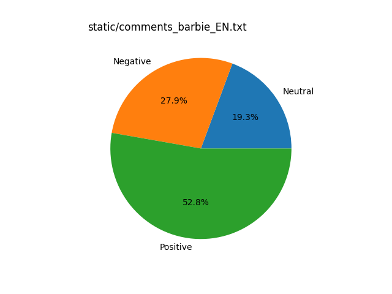
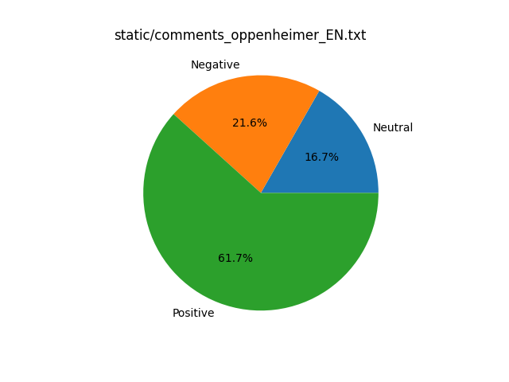

# Sentiment analysis for films Barbie and Oppenheimer based on filmweb.pl
This project was created for learning purposes while attending on NLP training. The subject of this project is sentiment analysis for two specified films: Barbie and Oppenheimer. The comments were scraped from Polish website [filmweb.pl](https://www.filmweb.pl) <br />

Python version used in the project: `3.10.11`

The project was performed in 4 major steps:

## 1. Get all comments sub-url for specified film
With webscraping through Python package `requests` comments sub-urls were listed and saved into text file. Together with main url of the film, it creates full url to the comment.

```
Moja+opinia,3365102
Gdybym+nie+wiedzia%C5%82+%C5%BCe+greta+gerwig+jest+feministk%C4%85,3364383
Cukierkowa+mowa+nienawi%C5%9Bci.,3365325
%C5%9Aliczna+i+m%C4%85dra+M.Robbie+i+nimoza+Ken+kontra+ca%C5%82y+%C5%9Bwiat.,336402316975240
Tragiczny+nie+polecam+dla+dzieci,3366202
Marketing+zabija+przekaz,3364687
```

## 2. Get comment text value
For both files with comments urls, comment values were obtained and saved to new file, in unchanged Polish language. With finding text value helped module `bs4` by finding specified class in obtained html.
```
Fabuła była dobra lecz jej przedstawienie było tragedią.(...)
"I'm Just Ken" na bank nominacje dostanie :)Już widzę wykonanie na gali :)(...)
Moralizatorska przypowiastka o niczym.(...)
Oj jak chciałem wystawić temu 1/10. Ale niestety nie mogę.(...)
```

## 3. Translate the comments from PL to EN with Google Translator API
Since the tools used for sentiment analysis sadly do not support Polish language, the comments must have been translated into any supported language - choice here was pretty obvious, English seems to be the most popular language and most of the people have no trouble to understand it.
The quality of translation is surprisingly good, the sense of the sentence as a whole is maintained. However, main installation of `googletrans` was returning a known error, so alpha version needed to be installed instead. Apart from this, translation process was quick and easy.
```
It wasn't a film about falling bombs, it was about a scientist, and a biographical one at that.(...)
The explosion is not shown because Oppenheimer did not witness it.(...)
It was a great scene! One of the best. For me, it's a film about politics,(...)
The film is black and white at times as events involve Strauss after the events of Oppenheimer.(...)
```

## 4. Get sentiment analysis from comments
For sentiment analysis `textblob` module was used. Results are base on simple check of comment polarisation:
```
= 0 -> neutral
< 0 -> negative
> 0 -> positive 
```

## Results
For Barbie film: \
\

For Oppenheimer film: \
\

For Barbie it can be seen that only about 50% of the comments are positive, while the second half is divided into negative and neutral. It looks like 'hate it or love it' film, which creates very strong feelings. Oppenheimer's comments are mostly positive - above 60%. The rest is also divided into negative and neutral. For both films negative comments are more numerous than neutral. To get more information, further analysis of comment content could be done: most frequent words, overall topic, summary of the opinion. 